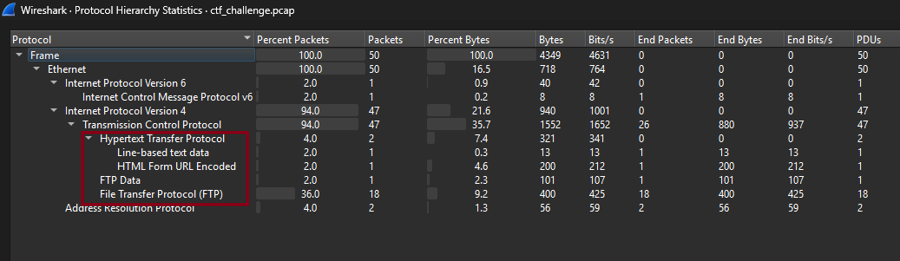

# 🔍 Network Traffic Analysis using Wireshark

<p align="center">
  
</p>


---

# 📖 Project Overview

This project demonstrates a structured network traffic analysis and forensic investigation performed using **Wireshark**, **CyberChef**, and **Python**.

The objective was to analyze a captured PCAP file, inspect network communications, identify security weaknesses, reconstruct application-layer sessions, analyze encrypted traffic, and recover the final CTF flag using systematic investigation techniques.

---

# 🎯 Objectives

- Analyze captured network traffic
- Identify communication protocols
- Reconstruct TCP sessions
- Recover transferred files
- Identify security vulnerabilities
- Analyze encrypted payloads
- Recover the hidden CTF flag
- Produce a professional technical report

---

# 🛠 Tools Used

| Tool | Purpose |
|------|----------|
| Wireshark | Packet Analysis |
| CyberChef | Data Decoding & AES Analysis |
| Python | XOR Brute Force Automation |
| Kali Linux | Investigation Environment |

---

# 🧠 Skills Demonstrated

- PCAP Analysis
- Network Traffic Analysis
- Network Forensics
- Protocol Analysis
- TCP Stream Analysis
- FTP Analysis
- HTTP Analysis
- ARP Analysis
- Vulnerability Identification
- AES Decryption
- XOR Analysis
- Python Automation
- Technical Documentation

---

# 🔄 Investigation Workflow

<p align="center">

</p>

```
PCAP
   │
   ▼
Wireshark
   │
   ▼
Protocol Analysis
   │
   ▼
FTP Investigation
   │
   ▼
HTTP Investigation
   │
   ▼
Configuration Recovery
   │
   ▼
AES Analysis
   │
   ▼
Python XOR Brute Force
   │
   ▼
Recovered Flag
```

---

# 📡 Initial Traffic Inspection

The packet capture was opened in Wireshark and inspected using the Protocol Hierarchy statistics.

Protocols identified included:

- ARP
- TCP
- FTP
- HTTP

<p align="center">

</p>

---

# 🌐 ARP Analysis

The investigation began with an ARP exchange where the client resolved the gateway MAC address before initiating communication.

Key observations:

- ARP Request
- ARP Reply
- Successful MAC Resolution

<p align="center">

</p>

---

# 🤝 TCP Three-Way Handshake

The FTP control connection was established using the standard TCP handshake.

Observed sequence:

- SYN
- SYN ACK
- ACK

<p align="center">

</p>

---

# 📂 FTP Analysis

The FTP control session revealed:

- Anonymous Authentication
- FTP Commands
- Passive Mode
- File Transfer

<p align="center">

</p>

<p align="center">

</p>

---

# 📁 Configuration File Recovery

The transferred configuration file was extracted from the FTP-DATA stream.

Recovered information included:

- Client Status
- AES Key
- Initialization Vector

<p align="center">

</p>

---

# 🌍 HTTP Traffic Analysis

After the FTP download, the client transmitted an encrypted HTTP POST request.

Analysis included:

- HTTP Request
- Base64 Payload
- Response Inspection

<p align="center">

</p>

---

# 🚨 Vulnerabilities Identified

| Vulnerability | Severity |
|---------------|----------|
| Anonymous FTP Access | Medium |
| Plaintext Cryptographic Material | High |
| Unencrypted FTP Communication | High |
| HTTP Without TLS | Medium |
| Exposure of Encryption Material | High |

---

# 🔐 AES Analysis

The recovered configuration contained an AES key and IV.

CyberChef was used to inspect the encrypted payload.

<p align="center">

</p>

---

# 🔓 Decrypted Payload

After AES analysis, the decrypted JSON revealed additional XOR encrypted data.

<p align="center">

</p>

---

# ⚡ XOR Brute Force

A Python script was developed to test all XOR keys and identify the correct plaintext.

<p align="center">

</p>

---

# 🏁 Flag Recovery

The automated analysis successfully recovered the challenge flag.

<p align="center">

</p>

---

# 📂 Repository Structure

```
network-traffic-analysis-wireshark
│
├── assets
├── docs
├── report
├── screenshots
├── scripts
├── README.md
```

---

# 📄 Technical Report

The complete technical investigation report is available here:

📄 **[Network Traffic Analysis Report](report/Network_Traffic_Analysis_Report.pdf)**

---

# 🎓 Lessons Learned

- Importance of protocol hierarchy analysis
- Session reconstruction using Follow TCP Stream
- Recovering transferred files from packet captures
- Identifying insecure network protocols
- Investigating encrypted communications
- Automating repetitive forensic tasks using Python

---

# 📚 References

- Wireshark Documentation
- CyberChef Documentation
- Python Documentation
- OWASP
- RFC 793 (TCP)
- RFC 959 (FTP)

---

# 📜 License

This project is released under the MIT License.
